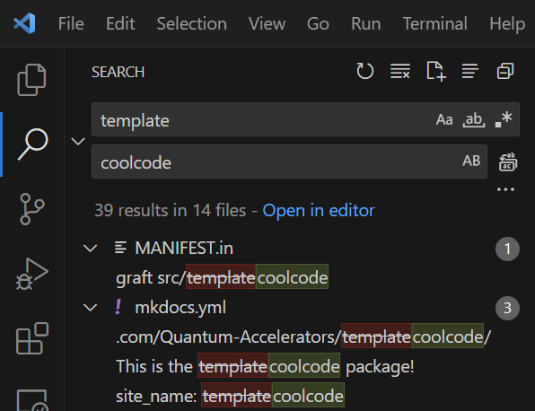

# Updating the Name

To make sure everything plays nicely with your own code, replace all instances of the word "template" with your package name.

!!! Note

    Don't forget to update the name of the [`src/template`](../../src/template) folder, e.g. so that it is of the form `src/<MyPackageName>`.

!!! Tip

    If you're using [Visual Studio Code](https://code.visualstudio.com/) as your editor, you can do ++ctrl+shift+H++ to find-and-replace all instances of "template" with your own package name.

    
