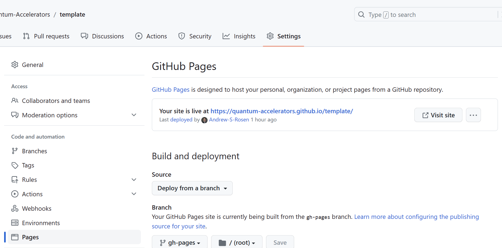

# Wrapping Up

## Pushing Your Changes

[Commit](https://github.com/git-guides/git-commit) any changes you've made and [push](https://github.com/git-guides/git-push) them to your repository

If you are using a program like GitKraken, this will involve the following steps:

1. Save your work.
2. Recommended: make a new branch for your work (e.g. `develop`)
3. Click "Stage all changes".
4. Add a helpful commit message.
5. Commit the changes.
6. Click "push".

!!! Tip

    It is advisable to make changes in a new branch rather than in `main` so that you can ensure your unit tests pass before the code is merged into the codebase.

Then go on GitHub to see your changes. Assuming you pushed your changes to a new branch, you'll likely see a message asking if you want to make a Pull Request to merge in your changes into the `main` branch.

## Deploying Your Documentation

To have your documentation automatically deployed on a GitHub webpage:

1. Go to the settings page of your repository.
2. Click the "Pages" section under "Code and automation."
3. Select "Deploy from a branch" under "Source"
4. Set the branch to be "gh-pages" with "/ (root)" as the folder.
5. Wait a minute and refresh the page. You'll see a message that your site is live with a URL to the documentation.

## That's All, Folks!

You now have everything you need to make a robust and sustainable Python package! Happy programming!
